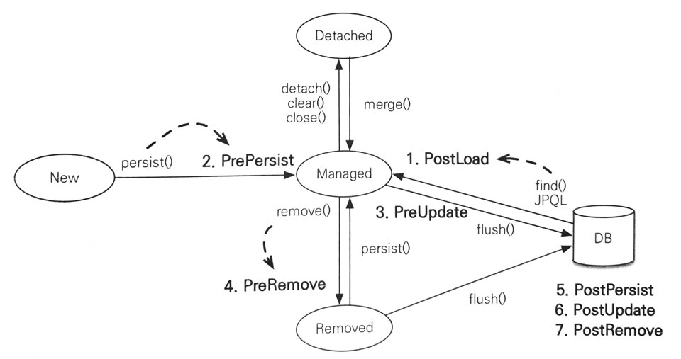

# 컬렉션

* JPA는 자바 기본 제공 컬렉션 지원.
  * @OneToMany, @ManyToMany 관계 매핑시 사용.
  * @ElementCollection을 사용해서 값 타입을 하나 이상 보관시 사용.
* JPA 명세에는 자바 컬렉션 인터페이스에 대해 특별한 언급 없음.
  * 구현체에 따라 제공하는 기능이 조금씩 다를 수 있음.
  * 보통 구현체의 기준은 하이버네이트를 기준으로 둠.

#### 자바 컬렉션 인터페이스의 특징

* Collection : 자바가 제공하는 최상위 컬렉션. 하이버네이트는 중복 허용하고 순서 보장하지 않는다고 가정.
* Set : 중복을 허용하지 않고 순서 보장하지 않음.
* List : 순서 보장하고 중복 허용.
* Map : Key, Value 구조로 되어 있는 특수 컬렉션.

## JPA와 컬렉션

* 하이버네이트는 엔티티 영속화 시, 컬렉션 필드를 하이버네이트에서 준비한 컬렉션으로 감싸서 사용.
  * @OneToMany 매핑타입으로 ArrayList를 사용했지만, 영속 상태가 되면 PersistentBag 타입이 됨.
* 컬렉션을 효율적으로 관리하기 위함으로 이런 특징 때문에 즉시 초기화를 권장.

```java
@Entity
public class Team {
  ...
  @OneToMany
  @JoinColumn
  private Collection<Member> members = new ArrayList<Member>();
  ...
}
```

## 하이버네이트 내장 컬렉션과 특징

|컬렉션 인터페이스|내장 컬렉션|중복 허용|순서 보관|
|---|---|---|---|
|Collection, List|PersistenceBag|O|X|
|Set|PersistenceSet|X|X|
|List + @OrderColumn|PersistentList|O|O|

### Collection, List

* ArrayList로 초기화.
* 중복 허용하므로 add()는 내부에 어떤 비교도 하지 않고 항상 true 반환.
* 같은 객체가 있는지 찾거나 삭제시 equals() 사용.
* 엔티티 추가시엔 중복된 엔티티가 있는지 비교하지 않아도 되기 때문에 추가시 지연 로딩된 컬렉션 초기화 하지 않음.

### Set

* HashSet으로 초기화.
* 객체 추가할 때 마다 equals()로 같은 객체 있는지 비교.
* HashSet은 해시 알고리즘을 사용하므로 hashcode()도 같이 사용.
* 엔티티 추가시에 중복된 엔티티가 있는지 검사해야 하기 때문에 지연 로딩된 컬렉션 초기화.

### List + @OrderColumn

```java
@OneToMany(mappedBy = "board")
@OrderColumn(name = "POSITION")
private List<Comment> comments = new ArrayList<>();
```

* List 인터페이스에 @OrderColumn을 추가해서 순서 있는 컬렉션으로 인식.
* 순서의 의미는 DB에 순서 값을 저장해서 조회할 때 사용하겠다는 의미.
* 위 코드에서는 List의 위치 값(index)을 COMMENT 테이블의 POSITION에 보관.
* 몇가지 단점들로 실무에서 잘 사용하지 않음.
  * @OrderBy를 사용하거나 개발자가 직접 순서 값 관리.

#### @OrderColumn의 단점

* @OrderColumn은 1:N에서 1쪽에 매핑하기 때문에 순서 값 컬럼을 N쪽에서 알 수 없음.
  * 위 소스코드에서 Comment를 INSERT할 때 POSITION 값 저장되지 않음.
  * POSITION은 Board.comments의 위치 값이므로, 이 값을 이용해 POSITION의 값 UPDATE SQL 추가 발생.
* List 변경 시, 연관된 많은 위치 값 변경 필요.
  * 2번째 위치의 값을 삭제하면 그 뒤의 데이터들 순서 값 변경을 위한 UPDATE SQL이 추가 발생.
* 중간에 POSITION 값이 없으면 조회한 List에는 null이 보관됨.
  * 강제로 2번째 위치의 데이터를 DB에서 강제로 삭제, 다른 데이터의 위치 값 변경하지 않으면 조회시에 삭제한 위치의 데이터는 null.
  * 컬렉션 순환 시 NullPointerException 발생.

### @OrderBy

* DB의 Order By절을 사용해서 컬렉션을 정렬.
* 모든 컬렉션에 사용이 가능.
  * Set의 경우는 순서 유지위해 LinkedHastSet을 내부에서 사용.
* @OrderBy의 값은 JPQL의 order by처럼 엔티티의 필드가 대상.

```java
@OneToMany(mappedBy = "team")
@OrderBy("username desc, id asc")
private Set<Member> members = new HashSet<>();
```

<br/>

# @Converter

* 엔티티의 데이터를 변환해서 데이터베이스에 저장 가능.

## 예제

* 자바의 boolean 타입을 DB에 문자 Y나 N으로 저장하고 싶을 때.

```java
@Entity
//클래스 레벨에 지정. 어떤 필드인지 명시 필요.
@Convert(converter=BooleanToYNConverter.class, attributeName = "vip")
public class Member {
  ...
  //변환할 필드에 직접 지정.
  @Convert(converter = BooleanToYNConverter.class)
  private boolean vip;
}

@Converter
public class BooleanToYNConverter implements AttributeConverter<Boolean, String> {
  @Override
  public String convertToDatabaseColumn(Boolean attribute) {
      return (attribute != null && attribute) ? "Y" : "N";
  }

  @Override
  public Boolean convertToEntityAttribute(String dbData) {
    return "Y".equals(dbData);
  }
}
```

## 글로벌 설정

* 모든 Boolean 타입에 컨버터를 적용하려면 아래 소스코드처럼 사용.
* @Convert 속성으로 disableConversion = true를 하면 글로벌 컨버터나 상속 받은 컨버터 사용하지 않음. 

```java
@Converter(autoApply = true)
public class BooleanToYNConverter implements AttributeConverter<Boolean, String> {
  ...
}
```

<br/>

# 리스너

* 엔티티의 생명주기에 따른 이벤트 처리를 할 수 있는 기능.
  * 예를 들어, 모든 엔티티를 대상으로 언제 어떤 사용자가 삭제를 요청했는지 로그로 남김.

## 이벤트 종류



1. PostLoad 
   * 엔티티가 영속성 컨텍스트에 조회된 직후.
   * refresh를 호출한 후(2차 캐시에 저장되어 있어도 호출).
2. PrePersist 
   * persist()를 호출해서 엔티티 영속화 직전 호출.
     * 식별자 생성 전략을 사용한 경우 식별자는 아직 미 존재.
   * 새로운 인스턴스 merge.
3. PreUpdate
   * flush나 commit을 호출해서 엔티티를 DB에 수정하기 직전.
4. PreRemove
   * remove()를 호출해서 엔티티를 영속성 컨텍스트에서 삭제 직전.
   * 삭제 명령어로 영속성 전이가 일어날 때.
   * orphanRemoval에 대해서는 flush나 commit 시 호출.
5. PostPersist
   * flush나 commit 호출해서 엔티티를 DB에 저장한 직후.
   * 식별자가 항상 존재.
6. PostUpdate
   * flush나 commit을 호출해서 엔티티를 DB에 수정한 직후.
7. PostRemove
   * flush나 commit을 호출해서 엔티티를 DB에 삭제한 직후.

## 이벤트 적용 위치

### 엔티티에 직접 적용

* 엔티티의 메서드에 애노테이션 지정.
  * @PrePersist, @PostPersist, @PostLoad, @PreRemove, @PostRemove...

```java
@Entity
public class Member {
    @PrePersist
    public void prePersist() {
      System.out.println("prePersist");
    }
}
```

### 별도의 리스너 등록

```java
@Entity
@EntityListeners(MemberListener.class)
public class Member {
    ...
}

public class MemberListener {
    @PrePersist
    public void prePersist() {
        System.out.println("prePersist");
    } 
}
```

## 기본 리스너 사용

* 모든 엔티티의 이벤트 처리시 META-INF/orm.xml에 기본 리스너 등록.

```xml
<?xml version="1.0" encoding="UTF-8"?>
<entity-mappings ...>
    <persistence-unit-metadata>
        <persistence-unit-defaults>
          <entity-listeners>
            <entity-listener class="jy.study.jpa.domain.listener.DefaultListener"/>
          </entity-listeners>
        </persistence-unit-defaults>
    </persistence-unit-metadata>
</entity-mappings>
```

## 여러 리스너 등록시 이벤트 호출 순서

1. 기본 리스너
2. 부모 클래스 리스너
3. 리스너
4. 엔티티

## 리스너 무시

* 기본 리스너 무시 : 엔티티에 @ExcludeDefaultListeners 선언
* 상위 클래스 이벤트 리스너 무시 : 엔티티에 @ExcludeSuperclassListeners 선언

<br/>

# 엔티티 그래프

* 엔티티를 조회하는 시점에 연관된 엔티티들을 함꼐 조회하는 기능.
* JPQL은 데이터를 조회하는 기능만 수행, 연관된 엔티티 조회는 엔티티 그래프를 사용.
  * fetch join으로 연관된 엔티티를 조회하는 여러 중복된 JPQL을 작성하지 않아도 됨.
* Named 엔티티 그래프, 동적으로 정의하는 엔티티 그래프가 있음.

## Named 엔티티 그래프

* @NamedEntityGraph로 정의.
  * name : 엔티티 그래프의 이름 정의.
  * attributeNodes : 함께 조회할 속성 선택. @NamedAttributeNode를 사용해서 함꼐 조회할 속성 선택.
* 둘 이상 정의 시, @NamedEntityGraphs 사용.

### 예제 : 주문을 조회할 때 연관된 회원도 조회

```java
@NamedEntityGraph(name = "Order.withMember", attributeNodes = {
    @NamedAttributeNode("member")
})
@Entity
public class Order {
    ...
    //member가 지연 로딩이지만 엔티티 그래프에 의해 함께 조회.
    @ManyToOne(fetch = FetchType.LAZY, optional = false)
    @JoinColumn(name = " member_id")
    private Member member;
}
```

## em.find()에서 Named 엔티티 그래프 사용

```java
//정의한 엔티티 그래프를 찾아옴.
EntityGraph graph = em.getEntityGraph("Order.withMember");

//JPA의 힌트 기능을 사용해서 동작.
Map hints = new HashMap();
//힌트의 키로 javax.persistence.fetchgraph를 사용, 힌트의 값으로 찾아온 엔티티 그래프를 사용.
hints.put("javax.persistence.fetchgraph", graph);

//엔티티 조회시 힌트 정보도 포함.
Order order = em.find(Order.class, orderId, hints);
```
