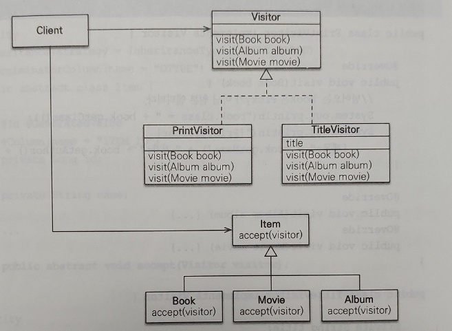

# 예외 처리

* JPA를 사용할 떄 발생하는 다양한 예외와 예외에 따른 주의점들.

## JPA 표준 예외

* javax.persistence.PersistenceException의 자식 클래스.
  * 모든 JPA 예외는 javax.persistence 패키지에 있음. 
  * RuntimeException의 자식. (모두 언체크 예외)
* 트랜잭션 롤백을 표시하는 예외와 표시하지 않는 예외 2가지로 나뉨.
  * 롤백을 표시하는 예외는 심각한 예외로 복구하면 안 됨.
    * 트랜잭션을 강제로 커밋해도 RollbackException 예외 발생.
  * 롤백을 표시하지 않는 예외는 심각한 예외가 아니므로 개발자가 커밋 또는 롤백할지 판단.

### 트랜잭션 롤백을 표시하는 예외

|예외|설명|
|---|---|
|EntityExistsException|EntityManager.persist()호출 시 이미 같은 엔티티가 있으면 발생.|
|EntityNotFoundException|EntityManager.getReference()를 호출했지만 실제 사용 시 엔티티가 존재하지 않으면 발생.<br/>refresh(), lock()에서도 발생.|
|OptimisticLockException|낙관적 락 충돌 시 발생.|
|PessimisticLockException|비관적 락 충돌 시 발생.|
|RollbackException|EntityTransaction.commit() 실패 시 발생.<br/>롤백이 표시되어 있는 트랜잭션 커밋 시에도 발생.|
|TransactionRequiredException|트랜잭션이 필요할 때 트랜잭션이 없으면 발생.<br/>트랜잭션이 없이 엔티티를 변경할 때 주로 발생.|

### 트랜잭션 롤백을 표시하지 않는 예외

|예외|설명|
|---|---|
|NoResultException|Query.getSingleResult() 호출 시 결과가 하나도 없을 때 발생.|
|NonUniqueResultException|Query.getSingleResult() 호출 시 결과가 둘 이상일 때 발생.|
|LockTimeoutException|비관적 락에서 시간 초과 시 발생.|
|QueryTimeoutException|쿼리 실행 시간 초과 시 발생.|

## 스프링 프레임워크의 JPA 예외 변환

* 서비스 계층에서 JPA의 예외를 직접 사용하면 JPA에 의존하게 됨.
* 스프링 프레임워크는 이런 문제 해결을 위해 데이터 접근 계층에 대한 예외를 추상화 함.

### JPA 예외를 스프링 예외로 변경

|JPA 예외|스프링 변환 예외|
|---|---|
|PersistenceException|org.springframework.orm.jpa.JpaSystemException|
|NoResultException|org.springframework.dao.EmptyResultDataAccessException|
|NonUniqueResultException|org.springframework.dao.IncorrectResultSizeDataAccessException|
|LockTimeoutException|org.springframework.dao.CannotAcquireLockException|
|QueryTimeoutException|org.springframework.dao.QueryTimeoutException|
|EntityExistsException|org.springframework.dao.DataIntegrityViolationException|
|EntityNotFoundException|org.springframework.orm.jpa.JpaObjectRetrievalFailureException|
|OptimisticLockException|org.springframework.org.jpa.JpaOptimisticLockingFailureException|
|PessimisticLockException|org.springframework.dao.PessimisticLockingFailureException|
|TransactionRequiredException|org.springframework.dao.InvalidDataAccessApiUsageException|
|RollbackException|org.springframework.transaction.TransactionSystemException|

## 스프링 프레임워크에 JPA 예외 변환기 적용

* JPA 예외를 스프링 프레임워크의 추상화 예외로 변경하려면 특정 객체를 스프링 빈으로 등록.
  * PersistenceExceptionTranslationPostProcessor
* @Repository를 사용한 곳에 예외 변환 AOP를 적용해서 변환.
* 예외를 변환하고 싶지 않으면 메서드에 thorws로 JPA 예외나 JPA 예외의 부모 클래스를 직접 명시.

## 트랜백션 롤백 시 주의사항

* 트랜잭션 롤백은 DB만 롤백하고 수정한 자바 객체까지 원상태로 복구하지 않음.
  * 즉, 엔티티가 수정된 상태로 영속성 컨텍스트에 남아 있게 됨.
* 새로운 영속성 컨텍스트를 사용하거나 EntityManager.clear()로 초기화한 다음 사용해야 함.

### 스프링 프레임워크의 예방방법

* 영속성 컨텍스트의 범위에 따라 다른 방법을 사용.

#### 1. 기본 전략 (트랜잭션당 영속성 컨텍스트)

* 문제가 발생하면 트랜잭션 AOP 종료 시점에 트랜잭션을 롤백하면서 영속성 컨텍스트도 함께 종료.

#### 2. OSIV (영속성 컨텍스트의 범위를 트랜잭션 범위보다 넓게 사용)

* 영속성 컨텍스트에 문제가 있어도 다른 트랜잭션에서 해당 영속성 컨텍스트를 그대로 사용하는 문제가 있음.
* 롤백시 영속성 컨텍스트를 초기화.

<br/>

# 엔티티 비교

* 영속성 컨텍스트가 같을때와 다를 때의 비교 방법을 다르게 해야 함.

## 영속성 컨텍스트가 같을 때

* 특정 엔티티를 조회하는 코드가 여러 곳에 있어도, 영속성 컨텍스트 범위가 같다면 같은 인스턴스의 엔티티를 조회.
  * 예를 들어, 테스트 클래스에 @Transactional을 선언하고 테스트.
  * 해당 테스트 메서드에서 실행될 서비스 로직들은 전부 같은 영속성 컨텍스트를 바라봄.
* 동일성(==), 동등성(equals), 데이터베이스 동등성(@Id)로 모두 비교 가능.

#### ※ 테스트 클래스에 @Transactional 적용

* 테스트가 끝날 때 트랜잭션을 커밋하지 않고 강제로 롤백.
* DB에 영향을 주지 않고 테스트를 반복해서 수행 가능.
* 롤백시 영속성 컨텍스트를 플러시하지 않는데, SQL을 콘솔 로그에서 볼 수가 없음.
  * 어떤 SQL이 실행되는지 확인하려면 em.flush()를 강제로 호출.

## 영속성 컨텍스트가 다를 때 엔티티 비교

* 예를 들어 테스트 클래스에 @Transactionl이 없고 서비스에 있으면 각 서비스별로 영속성 컨텍스트 범위를 가짐.
* 테스트 메서드에서 여러 서비스에 동일한 엔티티를 조회해오면, 각각의 엔티티는 전혀 다른 인스턴스가 된다.
  * 각 엔티티는 영속성 컨텍스트가 종료되어 준영속 상태가 된 엔티티들.
* 동일성(==) 비교는 실패. 
* 데이터베이스 동등성(@Id) 비교 가능.
  * 엔티티를 영속화해야 식별자를 얻을 수 있는 문제 있음. (영속화 전엔 null이라 비교 불가)
* 동등성(equals) 비교 가능. (권장)
  * equals를 오버라이딩해서 비즈니스 키가 되는 필드를 이용해 비교.
  * 주민등록번호나 회원이름과 연락처 등등.

<br/>

# 프록시 심화 주제

* 프록시는 원본 엔티티를 상속받으므로 클라이언트는 프록시인지 원봉인지 구분않고 사용.
* 원본 엔티티를 사용하다가 지연 로딩을 위해 프록시로 변경해도 클라이언트의 로직 수정 필요 없음.
* 프록시를 사용하는 방식의 기술적 한계로 문제들이 발생하기도 함.

## 영속성 컨텍스트와 프록시 (프록시 동일성 비교)

```java
//프록시로 조회
Member refMember = em.getReference(Member.class, "member1");
//원본 엔티티를 조회
Member findMember = em.find(Member.class, "member1");
//같음
Assert.assertTrue(refMember == findMember);
```

* 영속성 컨텍스트는 프록시로 조회된 엔티티에 대해 같은 엔티티 조회 요청이 오면 처음 조회된 프록시를 반환.
* 반대로 원본 데이터를 먼저 조회하면 프록시를 조회해도 원본 데이터를 반환함.
* 영속 엔티티의 동일성을 보장.

## 프록시 타입 비교

* 프록시로 조회한 엔티티의 타입을 비교할 땐 instanceof를 사용.
* 프로시의 타입은 끝에 _$$_jvsteXXX가 붙음.
  * jy.study.jpa.Member_$$_jvste843_0

```java
Member refMember = em.getReference(Member.class, "member1");
//부모 클래스와 자식 클래스를 비교한 것이 됨.
Assert.assertFalse(Member.class == refMember.getClass());
//프록시는 원본 엔티티의 자식 타입이므로 성립.
Assert.assertTrue(refMember instanceof Member);
```

## 프록시 동등성 비교

* 비즈니스 키를 이용해 equals() 메소드를 오버라이딩하고 비교.
* IDE나 외부 라이브러리를 사용해 equals()를 구현해서 프록시와 비교시 문제 발생.

```java
//equals 오버라이딩
public boolean equals(Object obj) {
    if (this == obj) return true;
    if (obj == null) return false;
    
    //프록시와 비교시 문제되는 코드 1
    if (this.getClass() != obj.getClass()) return false;
    
    Member member = (Member) obj;
    
    //프록시와 비교시 문제되는 코드 2
    if(name != null ? !name.equals(member.name) : member.name != null)
        return false;
    
    return true;
}

//테스트
Member newMember = new Member("member1", "회원1");
Member refMember = em.getReference(Member.class, "member1");
Assert.assertTrue(newMember.equals(refMember)); // 테스트 실패
```

* 위 문제코드1 
  * 동일성을 비교하고 있는데, 프록시와의 비교에선 instanceof를 사용해서 비교 필요.
  * if(!(obj instanceof Member)) return false;
* 위 문제코드2 
  * Member.name으로 프록시의 멤버변수에 직접 접근하는데, 프록시는 실제 데이터가 없고 null로 아무 값도 조회할 수 없음.
  * 프록시의 데이터를 조회할 땐 getter 접근자를 사용해서 프록시가 원본 엔티티의 데이터를 가져오도록 해야함.
  * if(name != null ? !name.equals(member.getName()) : member.getName() != null)

## 상속관계과 프록시

### 프록시 부모 타입으로 조회시 발생하는 문제

* Item을 각각 상속하는 Book, Movie, Album이 있음.
* Item을 멤버필드로 갖는 OrderItem이 있음.

```java
Book saveBook = new Book();
saveBook.setName("jpaBook");
saveBook.setAuthor("kim");
em.persist(saveBook); 
em.flush(); 
em.clear();

//POINT 1 Item 엔티티를 프록시로 조회
Item proxyItem = em.getReference(Item.class, saveBook.getId());
//POINT 2 출력결과 : proxyItem = class xxx.xxx...xxx.Item_$$_jvstXXX
System.out.println("proxyItem = " + proxyItem.getClass());

//POINT 3 proxyItem이 Book의 클래스 타입인지 확인.
if (proxyItem instanceof Book) {
    //POINT 4 다운캐스팅
    Book book = (Book) proxyItem;
    System.out.println("proxyItem = " + proxyItem.getClass());
}

Assert.assertFalse(proxyItem.getClass() == Book.class)
Assert.assertFalse(proxyItem instanceof Book);
Assert.assertTrue(proxyItem instanceof Item);
```

* POINT 3은 if문을 통과하지 못하고 실패.
* POINT 1에서 프록시가 Item 타입을 기반으로 만들어졌으며 프록시가 참조하는 엔티티는 Book 엔티티.
* POINT 2의 출력결과의 타입이 Item 타입을 상속해 만들어진 타입을 출력.
* 위의 이유들로 proxyItem은 Item$Proxy 타입이고 Book 타입과는 관계가 없음.
* POINT 4에서 proxyItem은 Book 타입과 관련이 없기때문에 다운캐스팅 에러 발생.

#### 다형성을 다루는 도메인 모델에서 문제 자주 발생

```java
@Entity
public class OrderItem {
  ...
  @manyToOne(fetch = FetchType.LAZY)
  @JoinColumn(name = "ITEM_ID")
  private Item item;
}

//테스트
OrderItem saveOrderItem = new OrderItem();
saveOrderItem.setItem(book);
em.persist(saveOrderItem); 
em.flush(); 
em.clear();

OrderItem orderItem = em.find(OrderItem.class, saveOrderItem.getId());
Item item = orderItem.getItem();

Assert.assertFalse(proxyItem.getClass() == Book.class);
```

* OrderItem과 item의 관계처럼 다형성 관계에서 지연로딩 시에 문제가 발생함.

## 상속관계에서 발생하는 프록시 문제 해결 방법

### 1. JPQL로 대상 직접 조회

* 가장 간단한 방법으로 처음부터 자식 타입을 직접 조회해서 필요한 연산 수행.
* 이 방법은 다형성을 활용할 수 없는 단점이 있음.

```java
Book jpqlBook = em.createQuery("select b from Book where b.id=:bookId", Book.class)
        .setParameter("bookId", item.getId())
        .getSingleResult();
```

### 2. 프록시 벗기기

* 하이버네이트가 제공하는 기능을 사용하면 프록시에서 원본 엔티티 조회 가능.

```java
public static <T> T unProxy(Object entity) {
    if (entity instanceof HibernateProxy) {
        entity = ((HibernateProxy) entity) 
                      .getHibernateLazyInitializer()
                      .getImplementation();
    }
    return (T) entity;
}

...
Item item = orderItem.getItem();
Item unProxyItem = unProxy(item);
...
```

* 프록시에서 원본 엔티티를 직접 꺼내기 때문에 프록시와 원본 엔티티의 동일성 비교가 실패하는 문제점 있음.
  * 위의 코드에서 item과 unProxyItem의 동일성 비교는 false가 됨.
* 원본 엔티티가 꼭 필요한 곳에서 잠깐 사용하고 다른 곳에서 사용되지 않도록 하는 것이 중요.
* 원본 엔티티의 값 변경시 변경 감지 기능 동작함.

### 3. 기능을 위한 별도의 인터페이스 제공

* 특정 기능을 제공하는 인터페이스 사용해서 다형성 활용.
* 여러 타입이 추가되어도 클라이언트 입장에선 코드의 수정없이 사용 가능하고, 대상 객체가 프록시인지 아닌지 고민하지 않아도 됨.
* 프록시의 특징 때문에 프록시의 대상이 되는 타입에 인터페이스를 적용해야 함.

#### 예제 : getTitle() 메서드를 정의한 TitleView 인터페이스 제공

```java
//인터페이스 정의
public interface TitleView {
    String getTitle();
}

//프록시의 대상인 Item이 인터페이스를 받아야 함
@Inheritance(strategy = InheritanceType.SINGLE_TABLE)
@DiscriminatorColumn(name = "DTYPE")
public abstract class Item implements TitleView {
  ...
}

@Entity
@DiscriminatorValue(name = "B")
public class Book extends Item {
  ...
  @Override
  public String getTitle() {
      //인터페이스 구현
  }
}

@Entity
@DiscriminatorValue(name = "M")
public class Movie extends Item {
  ...
  @Override
  public String getTitle() {
      //인터페이스 구현
  }
}

@Entity
public class OrderItem {
  ...
  @ManyToOne(fetch = FetchType.LAZY)
  @JoinColumn(name = "ITEM_ID")
  private Item item;
  ...
  
  //각 구현체(Item의 자식 클래스)가 구현한 인터페이스 메서드 호출해서 사용
  public void printItem() {
      System.out.println("TITLE="+item.getTitle());
  }
}
```

### 4. 비지터 패턴



* Visitor와 Visitor를 받아들이는 대상 클래스로 구성.
* 위 그림의 Item이 accept(visitor) 메서드로 Visitor를 받아들임.
  * Item은 단순히 받아들이기만 하고 실제 로직은 Visitor가 처리.

#### Visitor 정의

```java
public interface Visitor {
    void visit(Book book);
    void visit(Album album);
    void visit(Movie movie);
}
```

* visit()라는 메서드 정의, 모든 대상 클래스를 받아들이도록 작성.

#### Visitor 구현

```java
//대상 클래스의 내용을 출력해주는 Visitor 구현 클래스
public class PrintVisitor implements Visitor {
    @Override
    public void visit(Book book) {
        System.out.println("[PrintVisitor]" + ...);
    }
    @Override
    public void visit(Album album) {...}
    @Override
    public void visit(Movie movie) {...}
}

//대상 클래스의 제목을 보관하는 Visitor 구현 클래스
public class TitleVisitor implements Visitor {
    private String title;
    
    public String getTitle() {
        return title;
    }
    
    @Override
    public void visit(Book book) {
        title = book.getName() + ...;
    }
    @Override
    public void visit(Album album) {...}
    @Override
    public void visit(Movie movie) {...}
}
```

#### 대상 클래스 작성

```java
@Entity
@Inheritance(strategy = InheritanceType.SINGLE_TABLE)
@DiscrimnatorColumn(name = "DTYPE")
public abstract class Item {
  ...
  public abstract void accept(Visitor visitor);
}

@Entity
@DiscriminatorValue("B")
public class Book extends Item {
  ...
  @Override
  public void accept(Visitor visitor) {
      visitor.visit(this);
  }
}

@Entity
@DiscriminatorValue("M")
public class Movie extends Item {
  ...
  @Override
  public void accept(Visitor visitor) {
    visitor.visit(this);
  }
}

@Entity
@DiscriminatorValue("A")
public class Album extends Item {
  ...
  @Override
  public void accept(Visitor visitor) {
    visitor.visit(this);
  }
}
```

* 각각의 자식 클래스들은 부모에 정의한 accept(visitor) 메서드 구현.
* visitor의 visit() 메서드를 호출하면서 자신(this)을 파라미터로 넘김.
* 실제 로직 처리를 visitor에 위임.

#### 비지터 패턴 실행

```java
@Test
void visitorPattern() {
    ...
    OrderItem orderItem = em.find(OrderItem.class, orderItemId);
    Item item = orderItem.getItem();
    item.accept(new PrintVisitor());
}
```

* item.accept() 메서드를 호출하면서 파라미터로 PrintVisitor를 넘김.
* item은 프록시라서 프록시가 먼저 accept() 메서드를 받고 원본 엔티티의 accept() 실행.
* 원본 엔티티는 자신(this)를 visitor에 파라미터로 넘겨줌.

#### 비지터 패턴 사용시 장점

* 프록시에 대한 걱정 없이 안전하게 원본 엔티티에 접근 가능.
* instanceof나 타입캐스팅 없이 코드 구현 가능.

#### 비지터 패턴 확장성

* 비지터패턴은 새로운 기능이 필요할 때 Visitor만 추가하면 됨.
* 기존 코드의 구조를 변경하지 않고 기능 추가 가능.
  
#### 비지터 패턴의 단점

* 너무 복잡하고 [더블 디스패치](https://en.wikipedia.og/wiki/Double_dispatch) 를 사용해서 이해가 어려움.
* 객체 구조가 변경되면 모든 Visitor 수정 필요.

<br/>

# N+1 문제

* JPA 사용시 가장 주의해야 하는 문제.
* 처음 실행한 SQL의 결과 수만큼 추가로 SQL을 실행.

## 예제 코드

```java
@Entity
public class Member {
    ...
    @OneToMany(mappedBy = "member", fetch = FetchType.EAGER)
    private List<Order> orders = new ArrayList<Order>();
    ...
}

@Entity
@Table(name = "ORDERS")
public class Order {
    ...
    @ManyToOne
    private Member member;
    ...
}
```

* 회원과 주문정보는 1:N, N:1 양방향 연관관계.
* 회원이 참조하는 주문정보를 즉시 로딩(EAGER) 설정.

## 즉시 로딩과 N+1

### em.find()
 
* 특정 회원 하나를 em.find()로 조회하면 join으로 함께 조회.
```
* Java 코드
em.find(Member.class, id);

* 실행된 SQL
SELECT M.*, O.*
FROM MEMBER M
OUTER JOIN ORDERS O ON M.ID=O.MEMBER_ID
```

### JPQL
* 문제는 JPQL로 실행 시 즉시 로딩과 지연 로딩을 신경 쓰지 않고 JPQL만 사용해서 SQL을 생성.
  * JPQL로 작성된 그대로 SQL을 실행하려 함.


```
* Java 코드
List<Member> members = em.createUqery("select m from Member m", Member.class).getResultList();

* 실행된 SQL

1. 먼저 회원 엔티티를 애플리케이션에 로딩 
SELECT * FROM MEMBER

2. 회원 엔티티와 연관된 주문 컬렉션이 즉시 로딩이므로 각 회원별로 연관된 주문 조회
SELECT * FROM ORDERS WHERE MEMBER_ID=?
```

* 조회된 회원이 하나면 총 2번의 SQL이 실행되고, 회원이 5명이면 주문 조회 SQL이 5번 추가적으로 실행.

## 지연 로딩과 N+1

* 지연 로딩(LAZY)으로 설정 시 JPQL에서는 N+1 문제가 발생하지 않음.
* 회원만 조회되고 연관된 주문 컬렉션은 지연 로딩됨.
  * 이후 비즈니스 로직에서 주문 컬렉션 사용시 지연 로딩 발생.
* 하지만 연관된 엔티티 컬렉션을 반복문으로 하나씩 조회하면 N+1의 문제가 동일하게 발생함.

```java
// 지연 로딩이므로 회원만 조회
List<Member> members = em.createQuery("select m from Member m", Member.class).getResultList();

//회원 하나에 대해서만 초기화
Member firstMember = members.get(0);
firstMember.getOrders().size();

//모든 회원에 대해 초기화. N+1 문제 발생.
for (Member member : members) {
    System.out.println("member = " + member.getOrders().size());    
}
```

## 문제 해결 방법

### 1. 페치 조인 사용

* 가장 일반적인 방법으로 페치 조인은 SQL 조인을 사용하기 때문에 연관된 엔티티를 함께 조회.
  * 일대다 조인시 중복된 결과가 나타날 수 있어 JPQL DISTINCT 사용 추천.

```java
* JPQL
select m from Member m join fetch m.orders

* SQL
SELECT M.*, O.* FROM MEMBER M
INNER JOIN ORDERS O ON M.ID=O.MEMBER_ID
```

### 2. 하이버네이트 @BatchSize

* 하이버네이트가 제공하는 org.hibernate.annotations.BatchSize 사용.
* 연관된 엔티티를 조회 시 지정한 size만큼 SQL의 IN 절을 사용해서 조회.
  * 조회한 회원이 10명이고 size가 5이면 2번의 SQL이 추가로 실행.

```java
@Entity
public class Member {
    @org.hibernate.annotations.BatchSize(size = 5)
    @OneToMany(mappedBy = "member", fetch = FetchType.EAGER)
    private List<Order> orders = new ArrayList<Order>();
}

* SQL
SELECT * FROM ORDERS WHERE MEMBER_ID IN (?, ?, ?, ?, ?)
```

* 즉시 로딩시 조회 시점에 회원이 10건이면 SQL 2번 실행
* 지연 로딩이면 최초 사용하는 시점에 5건의 데이터를 미리 로딩.
  * 6번째 데이터를 사용하면 추가로 SQL 실행.

### 3. 하이버네이트 @Fetch(FetchMode.SUBSELECT)

* 하이버네이트의 org.hibernate.annotations.Fetch 어노테이션의 FetchMode SUBSELECT 사용.
* 연관된 데이터를 조회시 서브 쿼리로 N+1 문제 해결.
* 즉시 로딩이면 조회 시점에, 지연 로딩이면 연관 엔티티 사용 시점에 SQL 실행.

```java
* JPQL
select m from Member m where m.id > 10

* SQL
SELECT O FROM ORDERS O
WHERE O.MEMBER_ID IN (
    SELECT M.ID
    FROM MEMBER M
    WHERE M.ID > 10
)
```

## 정리

* 즉시 로딩보다는 지연 로딩 사용.
  * 즉시 로딩은 N+1 문제, 필요하지 않은 엔티티도 로딩, 성능 최적화 어려움.
  * 즉시 로딩이 연속으로 발생해서 예상하지 못한 SQL이 실행될 수 있음.
* 모두 지연 로딩을 사용하고 성능 최적화가 꼭 필요한 곳에는 JPQL 페치 조인 사용.

<br/>

# 읽기 전용 쿼리의 성능 최적화

* 한번 조회한 엔티티를 다시 조회하거나 수정할 일이 없을때 읽기 전용으로 조회.
* 다시 사용할 일 없는 엔티티들을 영속성 컨텍스트에 보관해두면서 낭비되는 메모리를 최적화.

## 여러 최적화 방법

```java
select o from Order o
```

위의 쿼리를 최적화하는 여러 방법

### 1. 스칼라 타입으로 조회

* 엔티티가 아닌 스칼라 타입으로 모든 필드를 조회.
* 스칼라 타입은 영속성 컨텍스트가 관리하지 않음.

```java
select o.id, o.name, o.price from Order p
```

### 2. 읽기 전용 쿼리 힌트 사용

* 하이버네이트 전용 힌트 org.hibernate.readOnly를 사용해서 읽기 전용으로 조회.

```java
TypedQuery<Order> query = em.createQuery("select o from Order o", Order.class);
query.setHint("org.hibernate.readOnly", true);
```

### 3. 읽기 전용 트랜잭션 사용

* 스프링 프레임워크 사용시 트랜잭션 읽기 전용 모드 설정 가능.
```java
@Transactional(readOnly = true)
```
* 하이버네이트 세션의 플러시 모드가 MANUAL로 설정됨.
  * 강제로 플러시를 호출하지 않는 한 플러시 발생하지 않음.
* 플러시할 때 발생하는 스냅샷 비교와 같은 기능이 발생하지 않아 성능 향상.
* 트랜잭션 시작, 로직수행, 트랜잭셩 커밋의 과정은 이루어지고 단지 영속성 컨텍스트 플러시만 발생하지 않음.


### 4. 트랜잭션 밖에서 읽기

* 트랜잭션 없이 엔티티를 조회.
* 트랜잭션을 사용하지 않으면 플러시가 일어나지 않아 조회 성능 향상.
  * 기본적으로 플러시 모드는 AUTO 라서 트랜잭션 커밋하거나 쿼리 실행시 플러시가 작동.
  * 트랜잭션 자체가 없기 때문에 트랜잭션을 커밋할 일이 없음.
  * JPQL 쿼리도 트랜잭션 없이 실행하면 플러시 발생하지 않음.

```java
//스프링 설정
@Transactional(propagation = Propagation.NOT_SUPPORTED)

//J2EE 표준 컨테이너 설정
@TransactionAttribute(TransactionAttributeType.NOT_SUPPORTED)
```

<br/>

# 배치 처리

* 일반적인 방식으로 엔티티를 조회하여 영속성 컨텍스트에 계속 쌓이면 메모리 부족 이슈 발생 가능.
* 수백만 건의 배치 처리는 영속성 컨텍스트를 적절한 단위로 초기화가 필요.
* 2차 캐시를 사용한다면 2차 캐시에 엔티티 보관하지 않도록 주의.

## JPA 등록 배치

* 수천 ~ 수만 건 한 번에 등록 시, 영속성 컨텍스트에 엔티티가 쌓이지 않도록 일정 단위마다 플러시하고 초기화 필요.
* 보통 2가지 방법을 주로 사용.
  1. 페이징 처리 : 데이터베이스 페이징 기능 사용.
  2. 커서(CURSOR) : 데이터베이스가 지원하는 커서 기능 사용.

### JPA 페이징 배치 처리

```java
int pageSize = 100;
for (int i = 0; i < 10; i++) {
    //100건씩 페이징 쿼리로 조회
    List<Product> resultList = em.createQuery("select p from Product p", Product.class)
        .setFirstResult(i * pageSize)
        .setMaxResults(pageSize)
        .getResultList();
    
    ...
    //페이지 단위마다 영속성 컨텍스트 플러시 & 초기화
    em.flust();
    em.clear();
}
```

### 하이버네이트 scroll 사용

* JPA는 JDBC 커서를 지원하지 않음 하이버네이트 세션을 사용.
* 하이버네이트는 scroll이라는 이름으로 JDBC 커서 지원.

```java
EntityTransaction tx = em.getTransaction();
//scroll은 하이버네이트 전용 기능이므로 em.unwrap()를 사용해 하이버네이트 세션 구함.
Session session = em.unwrap(Session.class);

tx.begin();
//쿼리를 조회하면서 scroll() 메서드로 ScrollableResults 객체를 반환받음.
ScrollableResults scroll = session.createQuery("select p from Product p")
        .setCacheMode(CacheMode.IGNORE) //2차 캐시 기능 off
        .scroll(ScrollMode.FORWARD_ONLY);

int count = 0;

//반환 받은 ScrollableResults 객체의 next() 메서드를 호출하면 엔티티 하나씩 조회 가능.
while (scroll.next()) {
    Product p = (Product) scroll.get(0);
    p.setPrice(p.getPrice() + 100);
    
    count++;
    if (count % 100 == 0) {
        session.flush();
        session.clear();
    }
}
tx.commit();
session.close();
```

### 하이버네이트 무상태 세션 사용

* 무상태 세션은 영속성 컨텍스트를 만들지 않고 2차 캐시도 사용하지 않음.
* 엔티티를 수정하려면 무상태 세션이 제공하는 update() 메서드를 직접 호출.

```java
SessionFactory sessionFactory = entityManagerFactory.unwrap(SessionFactory.class);
StatelessSession seesion = sessionFactory.openStatelessSession();
Transaction tx = session.beginTransaction();
ScrollableResults scroll = session.createQuery("select p from Product p").scroll();

while(scroll.next()) {
    Product p = (Product) scroll.get(0);
    p.setPrice(p.getPrice() + 100);
    session.update(p); //영속성 컨텍스트가 없기 때문에 직접 update() 메서드 호출.
}
tx.commit();
session.close():
```

<br/>

# SQL 쿼리 힌트 사용

* JPA 구현체가 아닌 데이터베이스 벤더에게 제공하는 힌트로 하이버네이트를 직접 사용.
* 하이버네이트 쿼리가 제공하는 addQueryHint() 메서드를 사용.

#### java 코드
```
Session session = em.unwrap(Session.class);
List<Member> list = session.createQuery("select m from Member m")
        .addQueryHint("FULL (MENBER)") //SQL 주석 추가
        .list();
```
#### 실행된 SQL
```
select
    /*+ FULL (MEMBER) */ m.id, m.name
from
    Member m
```

<br/>

# 트랜잭션을 지원하는 쓰지 지연과 성능 최적화

## 트랜잭션을 지원하는 쓰기 지연과 JDBC 배치

* 네트워크 호출 한 번에 드는 비용이 크기때문에 SQL을 모아서 한 번에 DB로 보내는게 성능상 좋음.
* JDBC가 제공하는 SQL 배치 기능으로 한 번에 SQL을 모아서 보내는것이 DB로 가능.
* 보통은 수백 수천 건 이상의 데이터를 변경하는 특수한 상황에 사용.
* 단점은 코드의 많은 수정이 필요하고 비즈니스 로직이 복잡한 경우 사용이 더 어려움.
* JPA는 JPA 플러시 기능으로 SQL 배치 기능을 호과적으로 사용 가능.
  * SQL 배치 최적화 전략은 구현체마다 조금씩 다름.

### 하이버네이트의 SQL 배치 기능 사용

```xml
<property name="hibernate.jdbc.batch_size" value="50"/>
```

* 위의 설정으로 최대 50건씩 모아서 SQL 배치 실행.
* 주의사항으로 SQL 배치는 같은 SQL일 때만 유효.
  * 중간에 다른 처리가 있으면 다시 시작.

#### ※ IDENTITY 식별자 생성 전략은 사용 불가

* 엔티티의 영속화는 식별자가 꼭 필요.
* IDENTITY 식별자 생성 전략은 DB에 저장해야 식벼자를 구할 수 있음.
* em.persist()를 호출하자마자 INSERT SQL이 DB로 전달되기 때문에 쓰기 지연이 불가능.

## 트랜잭션을 지원하는 쓰기 지연과 애플리케이션 확장성

* 쓰기 지연과 변경 감지로 인한 가장 큰 장점은 DB 테이블 로우에 락이 걸리는 시간의 최소화.
* 트랜잭션을 커밋해서 영속성 컨텍스트를 플러시하기 전까지 DB 로우에 락을 걸지 않음.

### 예제

```java
update(memberA); //UPDATE SQL A
비즈니스로직A(); //UPDATE SQL ...
비즈니스로직B(); //UPDATE SQL ...
commit();
```

#### 위 예제에서 JPA를 없이 사용할 때

* update(memberA) 호출 시 바로 수정 쿼리를 실행하면서 락이 걸림.
* 락은 비즈니스A 비즈니스B를 모두 수행하고 commit()을 호출할 때까지 유지.
* 보통의 트랜잭션 격리 수준은 DB에 현재 수정 중인 로우를 수정하려는 다른 트랜잭션은 락이 풀릴 때까지 대기.
 
#### 위 예제에서 JPA를 사용할 때

* commit()을 호출할 때 플러시와 함께 수정 쿼리를 실행하고 바로 DB 트랜잭션을 커밋.
* 쿼리를 보내고 바로 트랜잭션을 커밋하므로 락이 걸리는 시간을 최소화.

### 정리

* 사용자 증가시 애플리케이션을 서버를 증가하면 되지만 DB 락은 서버 증설만으로 해결 불가.
  * 오히려 서버 증설과 함께 트랜잭션이 더욱 증가해서 더 많은 락이 걸림.
* JPA의 쓰기 지연 기능은 락이 걸리는 시간을 최소화해서 동시에 더 많은 트랜잭션 처리 가능.


